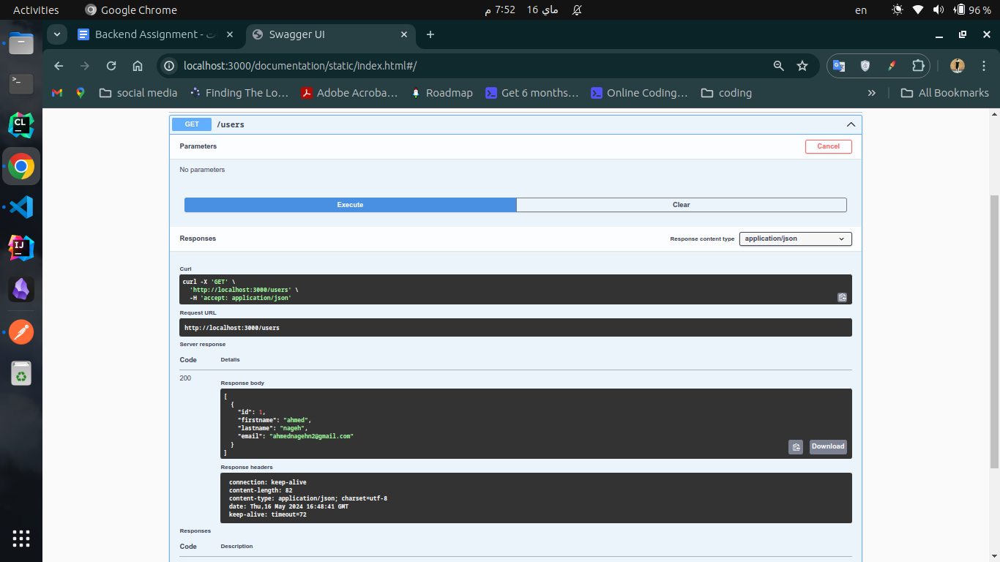
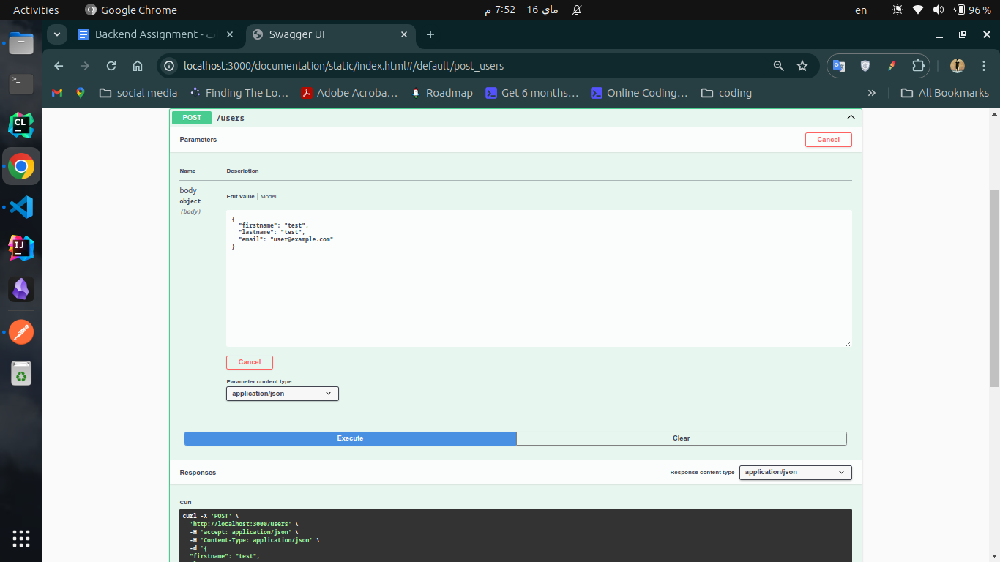
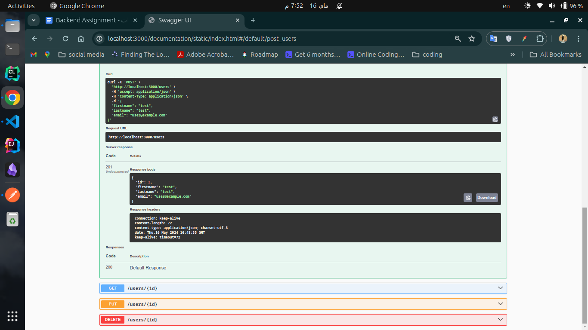
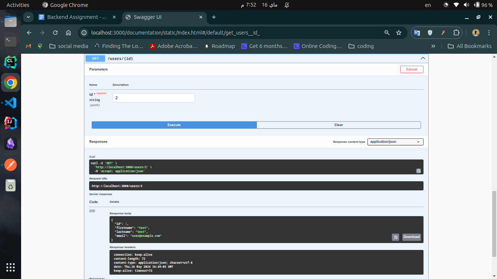
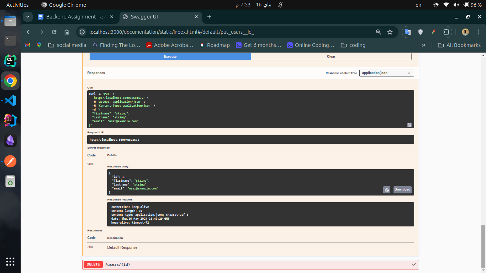
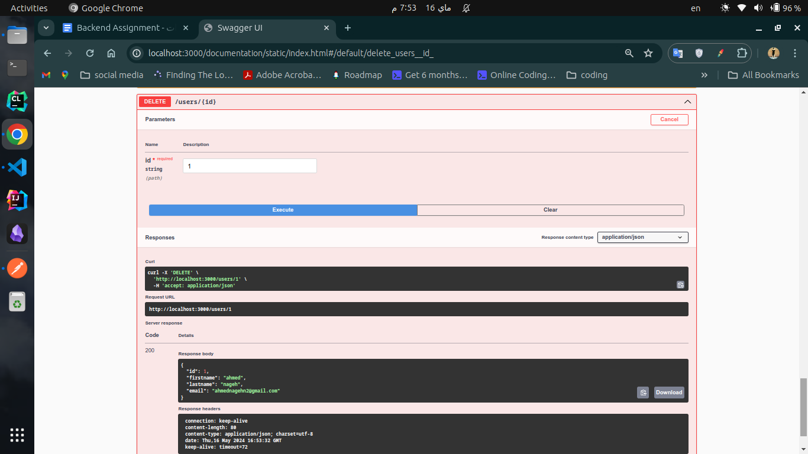
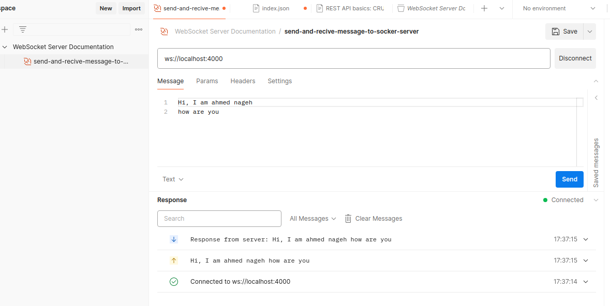

# Fastify Application with CRUD Operations and Socket Server Integration

## Running the Server

1. Clone this repository.
2. Navigate to the project directory.
3. Install dependencies with `npm install`.
4. Start the server with `npm start`.
- http://localhost:3000

### Environment Variables

- PORT: The port number to run the server on. Default is `3000`.

## Accessing the API Documentation (Swagger)

Once the server is running, you can access the Swagger documentation at:

http://localhost:3000/documentation

### endpoints: 
- `GET:    /users`:
   

- `POST:   /users`:
   
   

- `POST: /users/:id`: 
   

- `PUT:  /users/:id`:
   

- `DELETE: /users/:id`:
   

   

## Testing the Socket Server (Postman)

1. Install Postman if you haven't already.
2. Import the provided Postman collection.
3. Start the server.
4. Send requests to the WebSocket server using the endpoints in the Postman collection `ws://localhost:4000`

    
